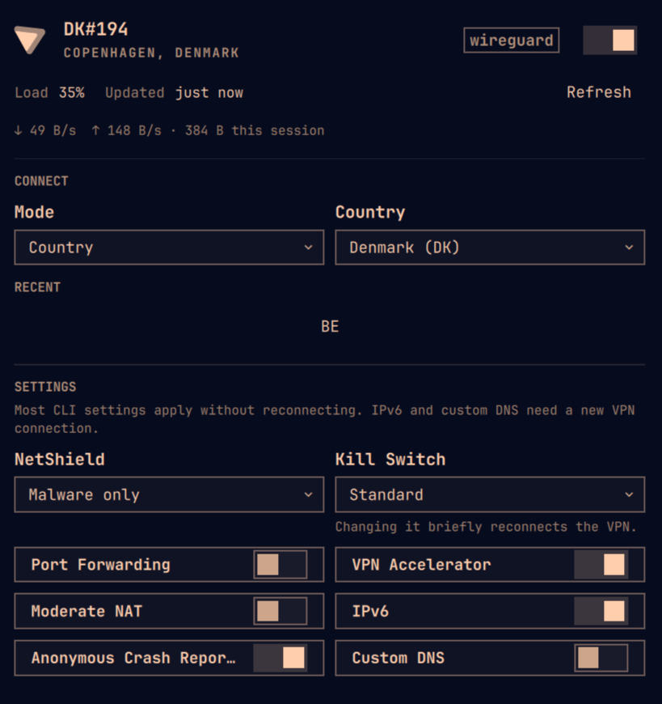
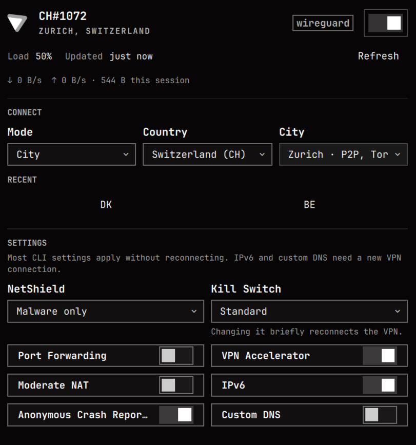
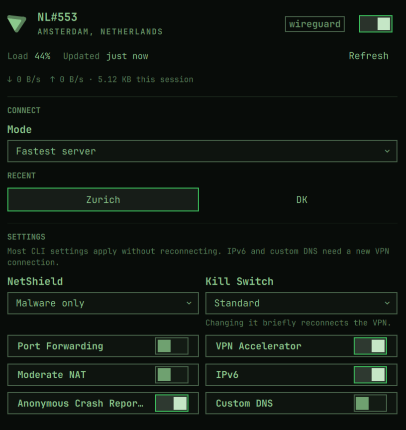

# Proton VPN for Omarchy

<p align="center">
  
  
  
</p>

A bar widget and keyboard-driven panel for Omarchy 4 (Quattro) that controls Proton VPN through Proton's official Linux CLI, `protonvpn`. Every connection and setting change goes through that CLI. The plugin does not reimplement Proton protocols, call Proton's private APIs, handle your credentials, edit Proton's files, or make network requests of its own. [Privacy](#privacy) lists exactly what it runs.

## What it does

- Connects to the fastest server, or by country, city, server ID, Secure Core, P2P, Tor, or a random server.
- Switches servers in place while connected, and lists recent connection targets under **RECENT** so you can return to one in a click.
- Shows live download and upload rates and session totals while the panel is open.
- Changes every setting `protonvpn config` exposes, including Kill Switch while connected, after asking first.
- Sends a desktop notification when the VPN drops while the panel is closed.
- Follows your Omarchy theme, and the panel works entirely from the keyboard.

## What you need

- Omarchy 4 (Quattro).
- The official Proton VPN CLI, `proton-vpn-cli`, signed in to your Proton account. See [Install the Proton VPN CLI](#install-the-proton-vpn-cli).
- NetworkManager, Python 3 at `/usr/bin/python3`, `which`, `wl-clipboard`, and libnotify (`notify-send`), all normally present on Omarchy. Without Python 3 no command can run.

## Install

Omarchy plugins run unsandboxed with your user privileges. Review the repository before enabling it.

### From the Omarchy menu

1. Choose **Setup → Plugins → Add Plugin**.
2. When asked for the git URL, enter this and nothing else:

   ```
   https://github.com/BVisagie/omarchy-protonvpn.git
   ```

3. Accept Omarchy's plugin warning. Omarchy clones and validates the plugin, then asks whether to enable it and which bar section to use. Right is preselected.

### From a terminal

```sh
omarchy plugin add https://github.com/BVisagie/omarchy-protonvpn.git
```

Omarchy shows the same warning, clones and validates the plugin, and asks whether to enable it. Add `--enable` to skip that question. Answer no to inspect the checkout at `~/.config/omarchy/plugins/io.github.BVisagie.protonvpn/` first, then enable it:

```sh
omarchy plugin enable io.github.BVisagie.protonvpn --section right
```

Without `--section`, the widget goes to the right section. To move it later:

```sh
omarchy bar move io.github.BVisagie.protonvpn --section center
```

### Install the Proton VPN CLI

```sh
sudo pacman -S proton-vpn-cli
```

`proton-vpn-cli` is in Arch's `extra` repository. Proton publishes an [Arch guide](https://protonvpn.com/support/linux-vpn-arch) for it, but a community contributor maintains the package, and Proton says support for Arch may be limited while it works towards official support. This plugin does not claim official Arch support.

Then sign in from a terminal. The panel never asks for a password or 2FA code:

```sh
protonvpn signin USERNAME
```

## Update

```sh
omarchy plugin update io.github.BVisagie.protonvpn
```

Omarchy shows the incoming changes and asks before applying them. It then fast-forwards the checkout, validates it, and rolls back if validation fails. The Omarchy menu has no update entry, so updates run from a terminal.

## Uninstall

Choose **Setup → Plugins → Remove Plugin** from the Omarchy menu, then select this plugin. Or from a terminal:

```sh
omarchy plugin remove io.github.BVisagie.protonvpn
```

This removes the plugin from Omarchy. It does not uninstall `proton-vpn-cli` or sign out of Proton VPN.

## Using the panel

- **Left-click** the bar icon to open or close the panel.
- **Right-click** connects or disconnects only while status is healthy and idle. Otherwise it opens the panel.
- **Middle-click** refreshes when no Proton command is running.
- The bar icon uses theme colors: connected is full strength, disconnected is dimmed, and degraded states add a warning badge. A slash marks disconnected or signed-out. Tooltip text names the current state.

Inside the panel:

- `j` / `k` or up/down arrows move the cursor between rows
- `h` / `l` or left/right arrows move the cursor across a row
- `Enter` / `Space` activates the selected control
- `t` toggles connect/disconnect with the same safety gate as right-click
- `r` refreshes
- `Tab` / `Shift+Tab` switches to the next bar panel
- `Esc` closes

While connected, changing the CONNECT choices shows a **Switch to …** button (for example **Switch to Zurich**). It reconnects in place with the new choices, and `Enter` in the Server ID field does the same. The header toggle and `t` still disconnect. City lists are cached for the shell session, so picking a country again shows its cities immediately; **Refresh** reloads them.

The last three successful connection targets are kept for the shell session and never written to disk. **RECENT** lists them without the current connection, so it shows only places you can switch to. When the CLI supplies a new exit IP after connecting, the panel shows it until the tunnel disconnects or changes.

Country and city lists come from `protonvpn countries list` and `protonvpn cities list`. Server IDs are entered as text because the CLI does not expose a machine-readable server list; Proton publishes IDs at [the account WireGuard server list](https://account.proton.me/vpn/WireGuard).

Settings cover every value exposed by `protonvpn config` on the tested CLI 1.0.1–1.0.3 range: NetShield, Kill Switch, port forwarding, custom DNS, VPN Accelerator, moderate NAT, IPv6, and anonymous crash reports. Changing Kill Switch while connected asks first, with Cancel selected. Confirming disconnects, changes the setting, and reconnects to the same target. If Proton rejects the change, the panel still reconnects and shows the error. IPv6 and custom DNS need a new VPN connection to apply. Custom DNS is validated locally and passed as one `--dns` argument.

Some rows show a short caption. Hover a CONNECT or SETTINGS control, or move onto it with `j` / `k`, for a Proton-sourced tooltip. That copy is paraphrased from Proton’s official support articles and the Linux CLI guide. It is not a substitute for those pages, and the widget does not fetch Proton’s website.

## Widget settings

| Setting | Key | Default | Range or values |
|---|---|---|---|
| Status refresh while the panel is open | `refreshIntervalSec` | 30 seconds | 10–3600 |
| Live link check interval | `linkWatchIntervalSec` | 4 seconds | 2–60 |
| Desktop notifications (only while the panel is closed) | `notifications` | `drops` | `off`, `drops`, `all` |

Change a setting with `omarchy bar set`. Numbers need `--json`:

```sh
omarchy bar set io.github.BVisagie.protonvpn notifications all
omarchy bar set io.github.BVisagie.protonvpn refreshIntervalSec 60 --json
```

A drop is any tunnel loss the widget did not start itself, including one from another terminal. `all` also notifies when the tunnel connects.

## Privacy

- The plugin executes a fixed set of local commands as argument arrays. It never interpolates values into a shell. See [Commands this plugin runs](#commands-this-plugin-runs).
- The runner caps stdout and stderr while commands execute, enforces deadlines, and reaps the complete child process group after a timeout or overflow.
- A read-only `nmcli connection show --active` probe observes `proton0`-style tunnel devices. It never creates, changes, or removes NetworkManager connections.
- It never collects, logs, stores, or passes Proton credentials.
- It does not use sudo or pkexec.
- It never makes extra network requests such as “what is my IP” lookups, map tiles, or telemetry.
- The exit IP is shown only when the Proton CLI itself returns it after connecting. Exit IP, recent targets, and traffic totals stay in memory and disappear when `omarchy-shell` exits.
- Traffic rates come from the tunnel's own kernel counters under `/sys/class/net/`. They are read every two seconds only while the panel is open and the tunnel is up. Captured test fixtures are synthetic or redacted.
- Raw CLI diagnostics are capped before they are shown.

Omarchy plugins run unsandboxed inside the long-lived `omarchy-shell` process with your user privileges. This plugin invokes `protonvpn` only after discovering it on `PATH`. Review the code before enabling it.

### Commands this plugin runs

Supervised by `scripts/run_bounded.py`, which caps output, enforces a deadline, and cleans up the process group:

- `/usr/bin/which protonvpn` to find the CLI
- `protonvpn` subcommands: `--help`, `status`, `connect`, `disconnect`, `countries list`, `cities list`, `config list`, and `config set`
- `/usr/bin/nmcli -t -e no -f NAME,TYPE,DEVICE,STATE connection show --active`
- `/usr/bin/cat /sys/class/net/<device>/statistics/rx_bytes /sys/class/net/<device>/statistics/tx_bytes`, only for a `proton0`-style device and only while the panel is open

Started directly, only when you press the matching panel control:

- `wl-copy` copies the suggested install or sign-in command
- `omarchy-launch-terminal` opens a terminal for signing in

Started directly when the tunnel changes while the panel is closed:

- `notify-send` sends a fixed desktop notification when the tunnel drops (or connects, if enabled)

## Limitations

- The official CLI cannot run at the same time as the Proton VPN desktop app. Close the GUI to use this widget.
- Headless setups and split tunneling are not supported by the CLI, so they are out of scope here.
- Location, feature, and some configuration choices can require a paid plan. The panel shows the CLI's error instead of guessing the account tier.
- `protonvpn status` does not provide the current exit IP. The widget never performs an external lookup, so the value is available only after a successful connect command that returned it.
- Omarchy creates a widget on each monitor. On Omarchy's built-in bar every panel uses one shared service, so Proton CLI commands are serialized across all monitors. Replacement bars cannot provide that service, so each panel there runs its own copy and polls separately.
- `protonvpn status` runs on a timer only while a panel is open. Each run starts Python and opens a new keyring connection, so with every panel closed it runs only at start-up, when the NetworkManager link changes, and after an action. If `nmcli` is unavailable, it keeps polling on the timer. The bar icon keeps following the tunnel through the read-only link probe, but a sign-out or a newly opened desktop app is noticed only when you open the panel or the link changes.
- The Proton CLI sometimes crashes while exiting, after printing its full output. Read-only commands (`status`, `countries list`, `cities list`, `config list`) accept that output when it parses. Settings must list every known key, and country or city lists from a crashed run are fetched again next time. Connect, disconnect, and setting changes never do.
- Desktop notifications are never sent while the panel is open.
- Changing Kill Switch while connected leaves you unprotected for a few seconds during the reconnect. That is why the panel asks first.

## Troubleshooting

Confirm the Proton CLI itself before assuming a widget bug. These failures belong to Proton, Arch packaging, or the local session:

```sh
pacman -Q proton-vpn-cli
protonvpn --help
protonvpn status
protonvpn countries list
```

The recorded parser fixtures target CLI versions 1.0.1 through 1.0.3. Versions outside that range receive a non-blocking compatibility warning; malformed status output still activates the existing stale-state safety gate.

**CLI not installed.** Install `proton-vpn-cli` from Arch extra, then refresh. The bar tooltip reads “Proton VPN CLI not installed.”

**Sign-in required.** Run `protonvpn signin USERNAME` in a terminal. Copy the command from the panel if useful. Refresh after signing in.

**Desktop app is running.** Quit the Proton VPN GUI. The CLI refuses to operate until it is closed.

**Keyring or Secret Service failure.** The CLI could not read saved credentials from the session keyring. Unlock or restart the keyring, then run `protonvpn status` in a terminal. The widget reports this as a local session error, not as signed-out and not as a parser bug.

**Daemon unavailable.** `proton-vpn-daemon` did not respond. Check the Proton CLI service, then refresh. This is a Proton CLI/service problem.

**Connection timeout.** `Timed out after 10s waiting for event(s): CONNECTED` means the CLI reached Proton but the handshake did not finish. Retry or check the network. This is separate from the widget's command-queue watchdog.

**Status looks outdated.** A failed or timed-out poll keeps the last good result and marks it stale. Connection and settings changes stay disabled until a fresh probe succeeds. Refresh after the network or Proton daemon recovers.

**Paid-plan or invalid option.** The panel shows the CLI message and keeps the previous healthy status when it can. Fastest connect remains available.

**Hung command.** A watchdog stops a stuck process and marks its job timed out. Queued commands start once that process has exited, and its late output is ignored.

**Update says it cannot fast-forward.** If you have not changed the checkout yourself, your copy predates a rewrite of this repository's history in September 2026. Remove the plugin and add it again; see [Uninstall](#uninstall) and [Install](#install).

**Validate the plugin:**

```sh
./scripts/check.sh
```

That script runs Node and Python tests, `omarchy plugin validate .` when Omarchy is installed, a QML contract check, bounded-runner tests, a `qmllint` syntax check, and shell-load smoke tests. The same portable checks run in GitHub Actions. `qmllint` reports many unresolved-import warnings because Quickshell and Omarchy imports only resolve inside `omarchy-shell`. The script ignores those and fails only on syntax errors, so a pass does not prove the widget loads. Test it in the bar before releasing.

## Architecture

- `Service.qml` is the Omarchy service shared by every monitor. It runs Proton CLI commands one at a time and stops a stuck one with a watchdog.
- `Scheduler.js` is the job queue behind it. User actions and city lists go ahead of background refreshes, each job has its own timeout, and output from a job that was already stopped is ignored.
- `Panel.qml` contains the compact bar control and reads state from the shared service. When the bar cannot provide one, it runs a local `Service` instance instead.
- `ProtonVpnIcon.qml` draws the Proton VPN mark in the current theme color for the bar and panel.
- `Model.js` contains parsers, validation, compatibility detection, and display rules covered by captured fixtures.
- `scripts/run_bounded.py` is a local process supervisor; it does not implement VPN behavior or make network requests.

## License

MIT. See [LICENSE](LICENSE).

Release history is recorded in [CHANGELOG.md](CHANGELOG.md).
